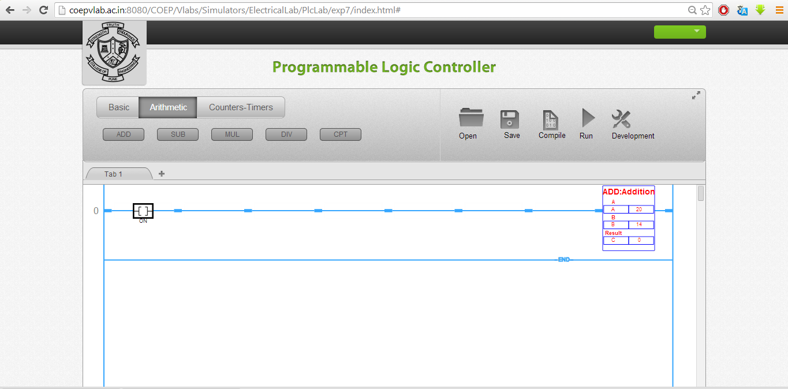
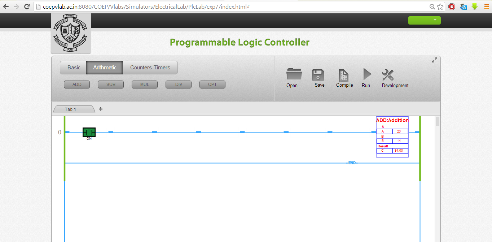

### Implementation of ADD instruction using Simulator
First click on simulator tab and open the simulator by clicking on the link.
1. Add a new rung.
2. Insert NO contact. Add the ADD block provided in the simulator. The screen shot will look as follows. 

3. Assign tag to NO contact and enter the addresses. Enter values for source A and B. Observe following screen shot.
 

4. For executing the instruction switch to run mode. Toggle the input contact and see the result at output Y as shown below.

